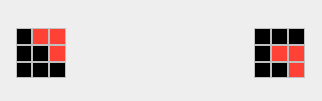

# ARC AGI adaptive algorithms and graphical representation experiments

## ARC AGI repo location

https://github.com/fchollet/ARC-AGI

## Graphical representation

A graphical representation of the training examples is now implemented.  This work is continuing.

One experimental example - a difference between input and output matrices for one example:

## Algorithmic development

Attempting to solve categories of the ARC AGI puzzles.

7 puzzles solved - 1.75% [Nov 15 2024]
10 puzzles solved - 2.50% [Nov 22 2024]
80 puzzles solved - 20.00% [Dec 10 2024]  (2.9 Tasks per day - 73 / 25)

## Translations

Work continues on "translations" - movement of entities in the matrix.  Some are pretty simple.

