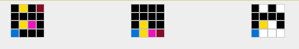

# ARC AGI adaptive algorithms and raphical representation experiments

## ARC AGI repo location

https://github.com/fchollet/ARC-AGI

## Graphical representation

A graphical representation of the training examples is now implemented.  This work is continuing.

One experimental example - a difference between input and output matrices for one example:

## Algorithmic development

Attempting to solve categories of the ARC AGI puzzles.

7 puzzles solved - 1.75% [Nov 2024]

[^ARCAGI] Abstraction and Reasoning Corpus for Artificial General Intelligence (ARC-AGI)